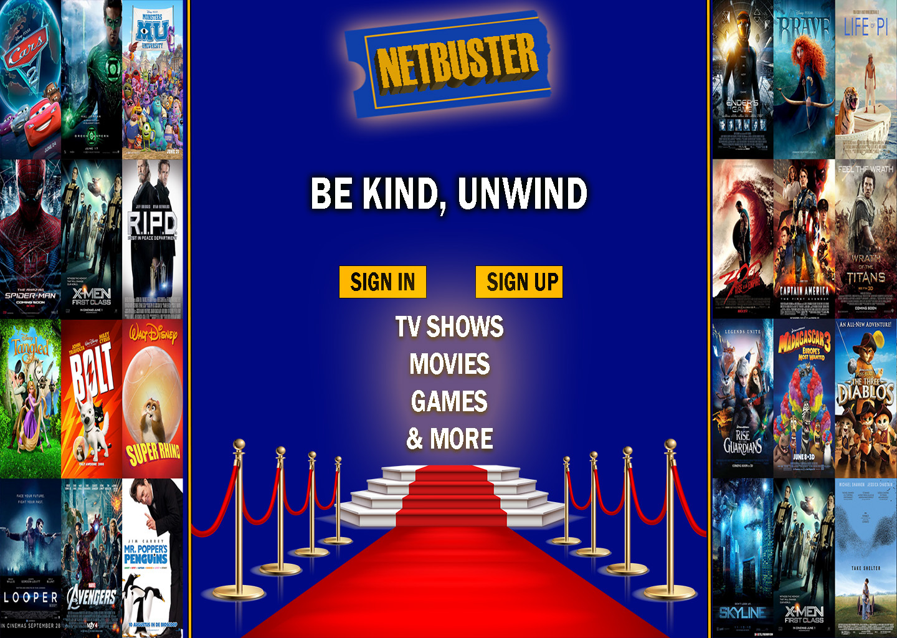

# Netbuster Project
### Created by Brandon Piquant and Luke Tyson

## Product Description
It's Friday night, it's been a long week, and you want to stay in, but what are you going to watch? Gone are the days of the brick-and-mortar video store and the expansive aisles of VHS tapes, DVDs, delicious snacks and beverages... but you don't have to say goodbye to the heartfelt fun of finding a flick to kick back and enjoy with your friends and loved ones. Blockbuster is back and better than ever with our brand new streaming service, Netbuster!
-Dozens upon dozens of videos to choose from
-Create a user profile to access our library and save your favorite shows!
-Browse by genre

## User Story
As a TV and Movie enthusiast, I want to be able to browse through a sizeable selection of movies and TV shows. I want to be able to browse by genre. I want a personal user account that will save my shows for me to be able to access them easily later.

### Stretch Goals
-Website saves timestamp for where users were at in each video.
-Profiles can have multiple users per account and save shows accordingly
-Users have a 'Home Video' option where they can upload their own videos
  *They can befriend other users
  *They can commect on other users' videos

## Wireframes
